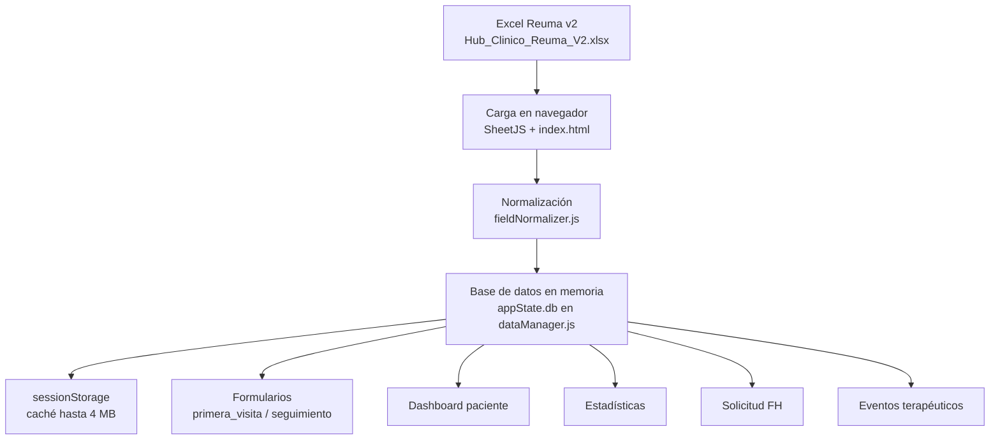
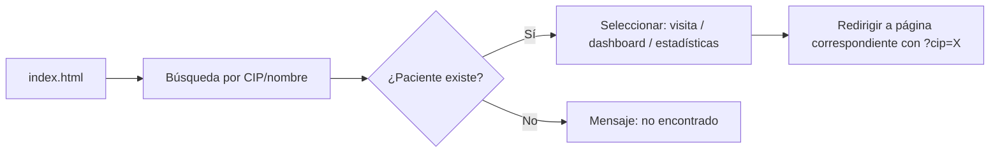
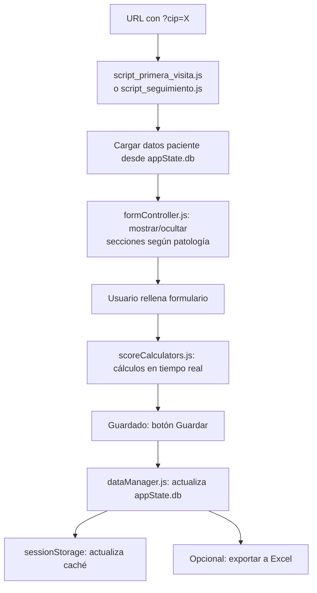
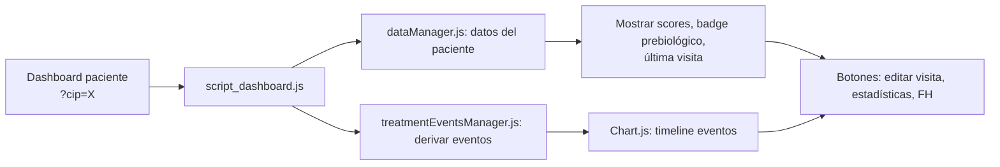
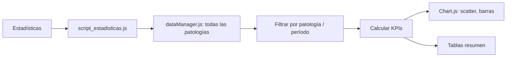
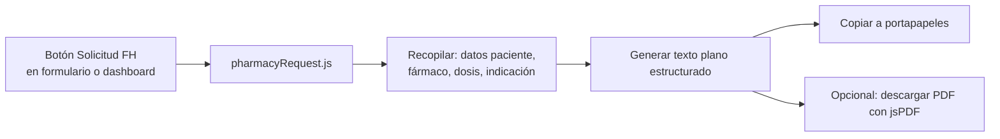
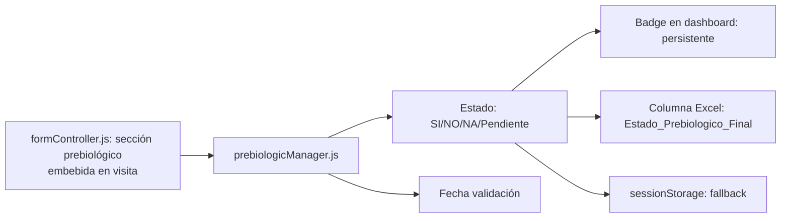
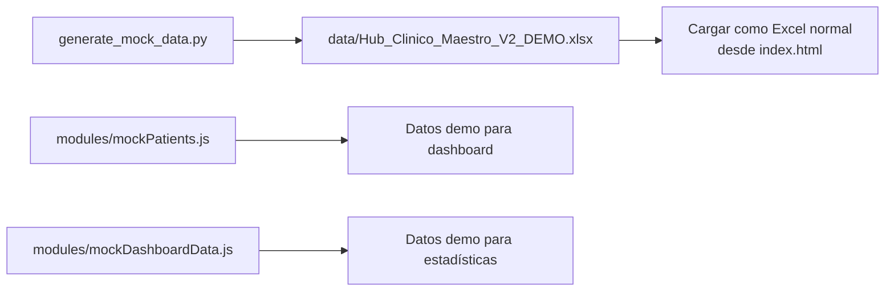

# Mapa de Flujos — App Reuma v2

**Versión:** 1.0  
**Fecha:** 2026-06-05  
**Proyecto:** Hub Clínico Reuma / PROMueve Extremadura  

---

## 1. Flujo general: Excel → App → Salidas

---

## 2. Entrada de datos

### 2.1 Carga de Excel

| Paso | Archivo | Descripción |
|------|---------|-------------|
| 1 | `index.html` | Usuario selecciona archivo `.xlsx` o carga demo |
| 2 | `script.js` + `dataManager.js` | SheetJS lee el libro completo |
| 3 | `dataManager.js` | Por cada hoja (`ESPA`, `APS`, `AR`, `LES`, `SJOGREN`, `Profesionales`, `Farmacos`): normaliza nombre, parsea filas |
| 4 | `fieldNormalizer.js` | Normaliza alias: `ID_Paciente` → `CIP`, compatibilidad LES/Sjögren |
| 5 | `dataManager.js` | Guarda en `appState.db` + `sessionStorage` |

**Entrada:** Archivo `.xlsx` con hojas clínicas de 497 columnas.
**Salida:** `appState.db` (objeto con arrays por patología).

### 2.2 Búsqueda de paciente

---

## 3. Formularios (primera_visita / seguimiento)

### Archivos implicados por patología

| Patología | FormController show/hide | Scores |
|-----------|------------------------|--------|
| AR | Sección AR visible | DAS28-VHS, DAS28-PCR, CDAI, SDAI |
| APs | Sección APs visible | DAPSA, mNAPSI, BSA, PASI |
| EspA | Sección EspA visible | BASDAI, ASDAS-CRP |
| LES | Sección LES visible | SLEDAI-2K, SLICC |
| Sjögren | Sección Sjögren visible | ESSPRI, ESSDAI |

El control de visibilidad se hace mediante `showElement()`/`hideElement()` en `formController.js`, activado por el diagnóstico primario del paciente.

---

## 4. Dashboard paciente

**Eventos terapéuticos** se derivan de las visitas existentes (cambios de tratamiento, scores, etc.) — no son un registro independiente.

---

## 5. Estadísticas

KPIs: nº pacientes, nº visitas, scores medios, distribución por actividad, evolución temporal.

---

## 6. Solicitud FH

**No hay receptor.** La solicitud se copia a portapapeles para que el reumatólogo la pegue donde corresponda. No hay módulo de Farmacia que la reciba automáticamente.

---

## 7. Prebiológico / Vacunación

---

## 8. Demo sintética

---

## 9. Puntos de integración futura (Enfermería / Farmacia)

| Punto | Flujo actual | Posible integración |
|-------|-------------|---------------------|
| Carga Excel | Un solo archivo Reuma v2 | Carga multiarchivo: Reuma + Enfermería + Farmacia |
| Timeline | Solo eventos derivados de Reuma | Mezclar eventos de Reuma + Enfermería + Farmacia |
| Dashboard | Datos de Reuma | Pestañas o secciones por perfil |
| Solicitud FH | Copia a portapapeles | Módulo de Farmacia que recibe y gestiona |
| sessionStorage | Caché única Reuma | Namespace o claves separadas por módulo |
| appState.db | Un solo `db` | `db.reuma`, `db.enfermeria`, `db.farmacia` |

> **Nota:** Estos son puntos de conexión identificados, no diseños cerrados. Requieren definición con Sil/Cora antes de implementar.
